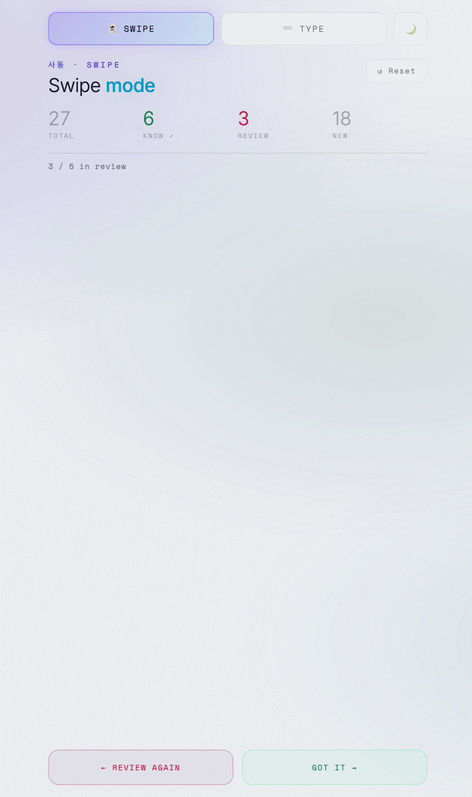

# Korean Flashcards

> A Korean vocabulary trainer with spaced repetition.




---

## Features

### Practice modes
| Mode | How it works |
|------|-------------|
| **🃏 Swipe** | Flip card to reveal Korean → swipe right *(got it)* or left *(review again)* |
| **⌨️ Type** | See English prompt → type the Korean word → instant feedback |
| **📝 Test** | Quiz mixing Match (3×3), True/False, and Type questions — covers every word in the set once |
| **📊 Progress** | Per-word status across both study modes; manually mark words as learned |
| **🧠 Memo** | Leitner spaced repetition across all sets in a folder — see below |

Both study modes share a review queue: missed words cycle back up to 5 times before new words appear.  
Type mode requires **2 correct answers in a row** to mark a word learned.

Test mode lets you choose which question types to include. Results show a score ring and a full answer review with corrections for wrong answers.

---

### 🧠 Memo mode (Leitner system)

Folder-level spaced repetition for logged-in users. Opens from any folder's contents page or via the **Continue learning** button on the main menu.

**Boxes and review intervals:**

| Box | Review every |
|-----|-------------|
| 1 | 1 day |
| 2 | 3 days |
| 3 | 1 week |
| 4 | 2 weeks |
| 5 | 1 month → archived (memorized) |

**Rules:**
- Correct → word advances to next box
- Wrong → word resets to Box 1 and reappears later in the same session
- Graduating from Box 5 → word is archived as memorized

**Session:** 20 words by default (configurable). Pulls all due cards first, then fills remaining slots with new words in chronological set order.

**First-time setup per folder:** choose direction (EN→KO or KO→EN), session size, and whether to import existing type-mode progress (known words start in Box 2) or begin everything from Box 1.

**Mid-session settings:** tap ⚙ in the top-right during a session to change direction or session size. Saving mid-session shows a confirmation dialog before resetting current progress.

**Main menu stats bar** (visible when signed in):

| Stat | What it counts |
|------|---------------|
| Today | Words answered correctly today (resets at midnight, stored in localStorage) |
| All time | Cumulative correct answers across all sessions (stored in Supabase) |
| Memorized | Words currently in Box 5 across all folders |

**Continue learning button:** appears on the main menu after the first memo session is started. Shows the folder name — e.g. *Continue learning: "My folder"*. New users without any memo session see a hint to choose a folder instead.

---

### 📁 Folders

Sets are organized into folders. The main menu shows a folder list; tapping a folder reveals its memo mode button and set cards.

- **Create** folders from the main menu (＋ New set → choose or create a folder)
- **Transfer** sets between folders via the *↗ Transfer set here* button inside a folder view
- **Share** a folder via URL — folders marked public get a shareable link; recipients can import all sets in one tap (requires sign-in)

---

### Sets
- **Built-in 사동 set** — 27 causative verb pairs with example phrases (끓이다, 먹이다, 살리다 …)
- **Custom sets** — create, edit, delete your own word lists, persisted in `localStorage` and synced to Supabase when signed in
- Per-set progress bar (average of swipe + type completion)

### Import / Export
- **↑ Import JSON** — load words from a `.json` file when creating or editing a set. Supported fields: `korean`, `english`, `sample_korean`, `sample_english` (plus common aliases like `word`, `definition`, `ko`, `en`)
- **↓ Export** — download any set (built-in or custom) as a `.json` file in the same format, ready to re-import or share

### NIKL dictionary lookup
When adding words to a custom set, typing a Korean word queries the **NIKL Korean–English Dictionary** (48 000+ entries). Matching entries appear inline with:
- Part of speech + difficulty level (초급 / 중급 / 고급)
- English definition
- Korean definition
- Sample sentence from the corpus

Click any suggestion to auto-fill the definition and example sentence fields.

### ✦ Import from photos *(experimental)*
Upload screenshots of a vocabulary book page and have an AI extract unmarked words automatically. Supports **Gemini** (free, recommended) and **OpenRouter** (paid models only for image input). API keys are stored locally in `localStorage` and never sent anywhere except the chosen provider.

> **Note:** OpenRouter free-tier models frequently lack image support — use Gemini for reliable results.

### Other
- **Light / dark theme** toggle (persisted), synced across all pages including memo mode
- Mobile-first, swipe gestures on touch screens
- Keyboard shortcuts in swipe mode: `←` / `→` arrows, `Space` / `Enter` to flip

---

## Getting started

```
git clone <repo>
cd sadong-flashcards
cp js/config.example.js js/config.js   # fill in your Supabase URL + anon key
open index.html                         # macOS
# or just double-click index.html in Finder / Explorer
```

No build step. No server required. Works from `file://`.

Memo mode and cloud sync require a [Supabase](https://supabase.com) project. Without `config.js`, the app works fully offline — only memo mode and sign-in are disabled.

> **First-time NIKL lookup:** `nikl_lookup.js` (~17 MB) loads in the background the first time you open the Create/Edit set page. The browser caches it after that.

---

## Dev mode

Lets you use signed-in-only features (memo mode, cloud-sync UI) without a real Supabase login — useful when the Supabase project is unreachable/paused. Uses a fake local `currentUser`; no real credentials involved. Only activates on `localhost`, never on a deployed build.

```
cd sadong-flashcards
python3 -m http.server 8000
open http://localhost:8000
```

In the browser console:
```js
localStorage.setItem('kf_dev_mode', '1')   // enable, then reload
localStorage.removeItem('kf_dev_mode')     // disable, then reload
```

`config.js` still needs to exist (copy from `config.example.js`) so the page loads without a JS error — the values inside it don't matter for dev mode.

---

## File structure

```
sadong-flashcards/
├── index.html              # HTML skeleton + all page markup
├── nikl_lookup.js          # pre-built NIKL dictionary index (window.NIKL_DATA)
├── css/
│   └── style.css           # all styles (themes, components, animations)
└── js/
    ├── data.js             # built-in word sets (BUILT_IN_SETS) + permanent folders/sets shipped with the app (PERMANENT_FOLDERS, PERMANENT_SETS)
    ├── sets.js             # custom set + folder CRUD, word rows, JSON import/export, NIKL lookup
    ├── study.js            # swipe engine, type engine, progress tracking, session state
    ├── test.js             # test mode (match, true/false, type questions + results)
    ├── import.js           # photo import modal, Gemini + OpenRouter API calls
    ├── config.js           # Supabase URL + anon key (git-ignored; copy from config.example.js)
    ├── auth.js             # Supabase auth, sign-in modal, cloud sync for sets + folders
    ├── memo.js             # Leitner memo mode (session logic, Supabase sync)
    ├── webtoon.js          # Webtoon mode: static story viewer, shown as a tab on sets with a matching story
    ├── app.js              # menu rendering, theme toggle, folder navigation, boot
    └── dev.js              # dev mode: fake signed-in session for local debugging (localhost only)
```

Plain script tags, no bundler, no ES modules — all variables and functions are global.

Script load order: `data.js → sets.js → study.js → test.js → import.js → config.js → auth.js → memo.js → webtoon.js → app.js → dev.js`

### Permanent folders/sets vs. custom folders/sets

Regular folders/sets a user creates live in `localStorage` (`kf_folders` / `kf_custom_sets`) and sync to Supabase when signed in. **Permanent** folders/sets (`PERMANENT_FOLDERS` / `PERMANENT_SETS` in `data.js`) ship with the app instead — same shape as a custom set/folder, but always present regardless of browser or login state, and not editable/deletable from the UI (`isPermanent: true` gates the edit/delete/share buttons in `app.js`). Used for content that should be the same for every user, e.g. `TOPIK30 / TOPIK Day 9`, which also carries a `webtoonId` linking it to a story in `webtoon.js`.

### Webtoon mode

A set's practice page (`js/app.js` `selectSet()`) shows a **🎨 Webtoon** tab alongside Swipe/Type/Test/Progress only when that set has a `webtoonId`. The story data (`WEBTOON_STORIES` in `js/webtoon.js`) is a static viewer for now — panel images plus a Korean/English transcript sheet (tap a line to reveal the translation). This is Phase 1 of a planned pipeline: an in-app "Generate webtoon" button that turns a set's words into a short illustrated story via LLM + image-gen (BYOK, same pattern as the photo-import feature), storing panels in Supabase once cloud storage is available. The data shape here (`images[]`, `panels[].korean/english/words`) is designed to match what that generator would also need to produce.

---

## Data storage

### localStorage

| Key | Contents |
|-----|----------|
| `kf_custom_sets` | JSON array of user-created sets |
| `kf_folders` | JSON array of user-created folders |
| `<setId>_swipe` | Swipe deck / review / known state |
| `<setId>_type` | Type deck / review / known state |
| `<setId>_learned` | Manually marked learned words |
| `memo_<folderId>_settings` | Memo settings per folder (direction, session size) |
| `memo_last_folder` | Last folder opened in memo mode (drives Continue learning CTA) |
| `memo_today` | `{ date, count }` — today's correct answer count (resets on date change) |
| `kf_theme` | `"light"` or `"dark"` |
| `kf_color_theme` | `"purple"` or `"sunlight"` — light mode color variant |
| `gemini_api_key` | Gemini API key for photo import |
| `openrouter_api_key` | OpenRouter API key for photo import |
| `openrouter_model` | OpenRouter model ID |
| `import_provider` | Last-used photo import provider |

## Stack

HTML · CSS · Vanilla JS · [GSAP 3](https://gsap.com) · [Supabase](https://supabase.com) · [Noto Serif KR](https://fonts.google.com/noto/specimen/Noto+Serif+KR) · [Space Mono](https://fonts.google.com/specimen/Space+Mono) · [Inter](https://fonts.google.com/specimen/Inter)
